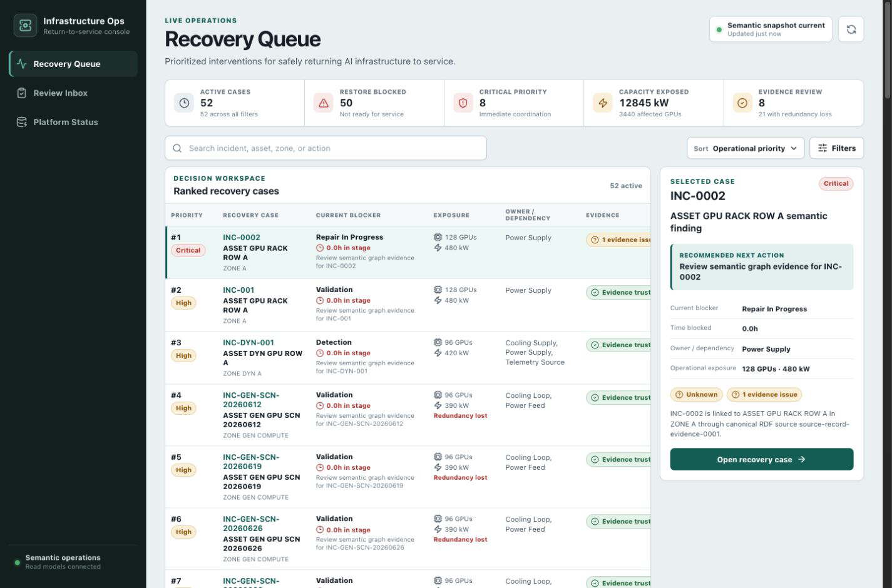
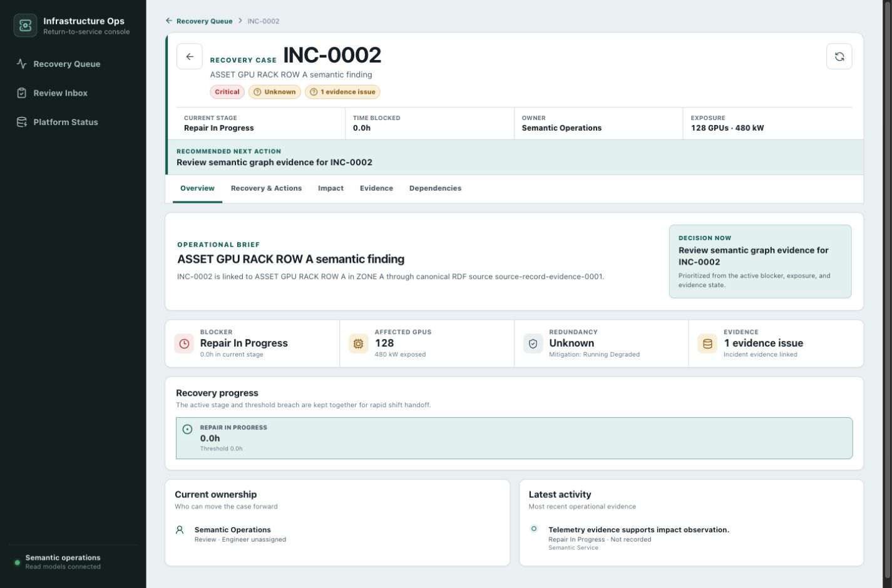

# AI Data Center Infrastructure Semantic Operations Platform

AI Data Center Infrastructure Semantic Operations Platform is an AI data center infrastructure semantic operations platform for facilities follow-up decisions.

It answers one practical question:

> Which AI infrastructure incidents are delaying return-to-service, where is the blocker, and what should the team follow up next?





## Naming Boundary

AI Data Center Infrastructure Semantic Operations Platform is the project and platform name. Downtime follow-up is the first operational workflow and use case implemented on the platform; it is not the overall project name.

## Why This Exists

AI data center downtime evidence rarely lives in one clean system. Incident records, workflow events, facility work orders, critical spares, vendor waits, validation results, telemetry alerts, impact snapshots, infrastructure assets, and facility zones are often scattered across different operational tools.

That creates a real follow-up problem: teams may know that work is open, but they cannot quickly tell whether GPU capacity risk is blocked by triage, engineer assignment, a spare/vendor wait, repair execution, validation, missed vendor ETA, lost redundancy, or unreliable source data.

This project builds a semantic operations layer for that problem. It preserves raw source records, normalizes them into a data center infrastructure model, reconstructs state from event history, validates the RDF graph with SHACL, exposes SPARQL-backed semantic evidence, and produces a ranked follow-up queue.

## Customer Problem

The fictional customer is an AI infrastructure operations team responsible for GPU data halls. During downtime, facilities supervisors, reliability engineers, capacity operations, and data engineers each see part of the truth:

- incident tickets show priority and current status
- work orders show team ownership and repair state
- spare and vendor notes show external dependencies
- telemetry shows power, cooling, thermal, and sensor evidence
- validation records show whether return-to-service is safe
- impact snapshots show affected racks, GPUs, kW at risk, redundancy, and mitigation

Before this system, the blocked operational decision was:

> Which open infrastructure incident should the operator chase next so GPU capacity can safely return to service?

The follow-up queue is the core product answer. Summaries, selected-row context, and detail pages support the decision, but they are not the main product surface.

## Operating Scenario

The modeled AI data center infrastructure workflow is:

```text
Incident Reported
-> Facilities Triage
-> Engineer Assigned
-> Spare/Vendor Waiting
-> Repair In Progress
-> Validation
-> Restored
```

The workflow labels are not the main value. The value is turning every transition into analytical evidence:

- how long an incident waited
- where delay accumulated
- whether the delay is still actionable
- which asset and zone are affected
- how much rack, GPU, power, thermal, redundancy, and vendor exposure is attached to the incident
- whether the evidence is trustworthy
- what follow-up action is most useful now

## What It Analyzes

- Open infrastructure incidents and delayed incidents
- Current stage and hours in current stage
- Stage lead time compared with threshold hours
- Actionable bottlenecks, excluding terminal restored work from active follow-up surfaces
- Downtime concentration by infrastructure asset and facility zone
- Vendor/parts escalation, work-order blockers, and recovery blocker risk
- Capacity-at-risk, affected GPU, redundancy state, thermal-breach, vendor/parts, and mitigation context
- Impact confidence status that separates trusted, warning, and unverified impact context
- Repeat failure signals
- Facilities engineer assignment and validation delays
- Latest-run data quality and reconciliation issues
- Ranked downtime follow-up queue with recommended actions

## Architecture

```text
scattered AI infrastructure source records
  -> source-to-canonical RDF mappings
  -> named RDF graphs in Fuseki/TDB2
  -> OWL/RDFS ontology modules
  -> SHACL validation gates
  -> approved SPARQL read models
  -> Kotlin/JVM semantic-service
  -> React semantic operations workbench
```

The RDF graph store is the source of truth. The Kotlin/JVM semantic-service is the controlled API facade over approved query IDs, typed result envelopes, provenance, and semantic error contracts.

## Source Integration Model

The simulated sources represent the systems an operator normally has to reconcile manually:

- incident system
- workflow event history
- facility work order system
- critical spare and inventory context
- vendor ETA context
- telemetry alerts and readings
- validation results
- impact snapshots

See `docs/01_architecture.md` for the source-to-question mapping and trust risks.

## Ontology-Native Runtime

- `ontology/modules/`: OWL/RDFS modules for core, infrastructure, topology, workflow, impact, evidence, provenance, AI interaction, and operations concepts
- `shapes/`: SHACL contracts for source, canonical, reasoning, and service-boundary graph validation
- `fixtures/` and `rdf-mapping/`: source-to-canonical RDF fixtures and mapping contracts
- `queries/manifest.ttl`: approved read-only query catalog plus reference-only historical query metadata
- `reasoning/`: executable Kotlin reasoning pipeline contracts, validation gates, rollback-safe promotion, and reference-only historical query/rule boundaries
- `semantic-service/`: Kotlin/JVM runtime that loads approved queries, talks to Fuseki/TDB2, shapes typed result envelopes, serializes success/error responses, and serves the private semantic query endpoint
- `frontend/`: React/Vite semantic operations workbench with feature-owned Recovery Queue, Recovery Case, Review Inbox, and Platform Status repositories

## Semantic-Service Responsibilities

- Load and statically validate semantic service contracts
- Connect to Fuseki/TDB2 through a read-only graph access boundary
- Load controlled RDF fixtures through validation/provenance gates
- Execute only approved read-only SPARQL query IDs from the manifest
- Bind every approved query definition to one registry-owned result codec,
  feature owner, private-endpoint policy, and optional stable paging policy
- Shape graph bindings into typed Kotlin result envelopes
- Serialize all endpoint responses through the semantic response serializer
- Reject raw SPARQL, unapproved query IDs, graph writes, public exposure, and non-loopback endpoint binding
- Provide graph-backed read models for the recovery queue and case, governed
  review queues, action audit history, AI proposal review, platform status,
  impact, topology, trust, validation, dependency impact, and blast radius

## Production Story

The practical production path is intentionally modest:

- Dockerized Fuseki/TDB2 graph store
- Kotlin/JVM semantic-service runtime
- React frontend build target
- controlled RDF fixture/source loading through validation gates
- approved SPARQL read-model execution
- provenance-aware semantic response envelopes
- SHACL and query contract checks
- deployment and rollback notes

Kubernetes, Airflow, Kafka, and OpenTelemetry can be added later if they solve a specific operational need. They are deployment and integration choices, not the story. The story is faster, more trusted return-to-service follow-up.

Run Fuseki locally:

```bash
docker compose up fuseki
```

Run the private semantic endpoint after Fuseki has fixture graphs loaded:

```bash
docker run --rm \
  -v "$PWD":/workspace \
  -w /workspace/semantic-service \
  -e DCAI_FUSEKI_DATASET_URL=http://host.docker.internal:3030/infrastructure \
  gradle:8.10.2-jdk17 \
  gradle --no-daemon run --args="--repo-root=/workspace --serve-private-query-endpoint"
```

## Semantic API Surface

Current private endpoint:

```text
POST /semantic/query/{queryId}
```

Approved product read-model query IDs include:

- `semanticFollowUpQueueList`
- `semanticDashboardOverview`
- `semanticPlatformStatus`
- `semanticFilterMetadata`
- `semanticFollowUpDetail`
- `semanticTopologyDependencies`
- `semanticTrustFindingList`
- `semanticValidationSummary`
- `semanticIncidentEvidence`
- `semanticIncidentTimeline`
- `semanticDependencyImpactByAsset`
- `semanticBlastRadiusByAsset`
- `semanticPromotionReviewQueue`
- `semanticReasoningReviewQueue`
- `semanticAvailableActionsByFinding`
- `semanticActionReviewQueueByIncident`
- `semanticActionTransitionHistoryByIncident`
- `semanticAiProposalReviewQueue`
- `semanticAiProposalDetailByIncident`

The complete approved catalog lives in `queries/manifest.ttl`. The endpoint is
internal/loopback only. It accepts approved query IDs, not raw SPARQL text.
Legacy and diagnostic read models remain backend/internal contracts and are not
published in the frontend catalog.

Read models can opt into server-side paging with a one-based `page` and a
`pageSize` from 1 to 100. Paged responses add backward-compatible `pageInfo`
containing the current page, page size, page count, and stable-identity total.
The service counts decision identities in Fuseki, selects a bounded identity
page with deterministic ordering, and retrieves only rows for that page before
typed shaping; unpaged response envelopes remain unchanged.

## Return-to-Service Operations Console

The React frontend is a queue-first operations console. Operational decisions
come before ontology vocabulary; semantic evidence remains available where it
helps an operator judge urgency, impact, or trust.

### Recovery Queue (`/`)

- Ranks recovery cases by intervention priority in the first viewport
- Compares the active blocker, time in stage, GPU and power exposure,
  redundancy, owner or dependency, and evidence status
- Keeps search, sorting, and filters in the URL for reloadable and shareable
  operational views
- Updates a selected-case decision preview without accidental row navigation;
  opening the full case remains an explicit action

### Recovery Case (`/recovery-cases/{incident_id}`)

- Keeps stage, time blocked, owner, exposure, restore readiness, evidence, and
  recommended action visible above the workspace tabs
- Organizes the case into Overview, Recovery & Actions, Impact, Evidence, and
  Dependencies; `?tab=` preserves deep links and browser history
- Uses keyboard-accessible tabs with roving focus, arrow-key wrapping, Home/End
  navigation, and explicit tab-to-panel relationships
- Loads the core case independently, then refreshes timeline, evidence/trust,
  impact reasoning, governed actions, AI governance, playback, and topology as
  isolated resources. Optional failures keep the core case usable, and each
  approved query is issued at most once per refresh.
- Keeps absent operational measurements and evidence verdicts explicitly
  unknown; missing graph facts are never presented as zero or trusted.
- Collects editable actor, reason, team, assignee, status, or summary fields
  before supported governed actions are submitted
- Shows valid action lifecycle transitions and audit history without mutating
  canonical, reasoning, operations, production, or external source-system state

The legacy `/findings/{incident_id}` path remains a compatibility alias.

### Review Inbox (`/reviews`)

- Separates governed actions, AI proposals, promotion reviews, reasoning
  reviews, and case-attention signals into explicit categories
- Treats `PENDING_HUMAN_REVIEW` AI proposals as actionable and provides
  reviewer/reason forms for approval or rejection
- Enables only valid governed-action lifecycle transitions; promotion and
  reasoning reviews remain read-only because no write contract exists
- Uses stable read-model deduplication and service-owned paging so result totals
  describe authoritative decisions rather than duplicated bindings or a single
  client-loaded page
- Persists category, page, and committed search state in the URL

### Platform Status (`/platform-status`)

- Separates technical platform health from incident severity
- Reports source-backed service connectivity, source freshness, graph release,
  reasoning, reconciliation, data quality, and topology coverage
- Uses the tri-state verdict `Operational`, `Degraded`, or `Unknown`; missing
  persisted validation evidence is never presented as success
- Shows bounded lifecycle previews and routes full review work to Review Inbox
- Uses stable finding identity and service-owned paging for large result sets

Across all workspaces, loading, empty, partial, stale, and error states are
route-specific. The console includes visible focus states, a skip link,
descriptive controls, responsive table-to-record layouts, and browser history
behavior for URL-addressable state.

## Verification

Run frontend unit tests, lint, and the production build:

```bash
cd frontend
npm test
npm run lint
npm run build
```

Run semantic-service tests from the repository root:

```bash
docker run --rm \
  -v "$PWD":/workspace \
  -w /workspace/semantic-service \
  gradle:8.10.2-jdk17 \
  gradle --no-daemon test
```

Run the SPARQL parser check after installing the RDF tooling described in
`docs/06_verification_plan.md`:

```bash
PYTHONPATH=/tmp/dcai-rdf-tools python3 queries/validate_sparql.py
```

## Tech Stack

- RDF/OWL
- SHACL
- SPARQL
- Apache Jena/Fuseki/TDB2
- Kotlin/JVM
- Gradle
- React
- TypeScript
- Vite
- Docker Compose

## Reading Path

- `docs/00_project_brief.md`: customer problem, users, success questions, and scope
- `docs/07_workflow_ontology.md`: lifecycle, allowed transitions, semantic ontology runtime, dependency states, and restoration rules
- `docs/01_architecture.md`: source integration model and layer responsibilities
- `docs/08_analytics_control_layer.md`: state reconstruction, scoring, reconciliation, and trust boundary
- `docs/09_production_rollout.md`: deployment, scheduling, health, observability, data quality reporting, and rollback
- `docs/10_operational_case_study.md`: Problem -> Discovery -> Data sources -> Workflow model -> System design -> Tradeoffs -> Production rollout plan -> Measured impact
- `docs/11_topology_semantic_connectors.md`: topology graph, semantic ontology API, Fuseki sync, and connector contracts
- `docs/12_ontology_native_rewrite_execplan.md`: full rewrite ExecPlan for an ontology-native AI semantic operations platform
- `docs/13_ontology_native_target_architecture.md`: target ontology-native architecture, graph model, modules, reasoning, AI governance, and old-runtime removal plan
- `docs/14_ontology_native_verification_plan.md`: rewrite verification gates for ontology, SHACL, SPARQL, reasoning, AI governance, UI, and old-runtime removal

The `phase*` documents below are historical implementation checkpoints. They
preserve the state and constraints of each phase when it was written; use the
current runtime sections above plus the post-cutover and hardening notes for the
latest behavior.

- `docs/ontology-native/phase1_semantic_runtime_scaffold.md`: Phase 1 scaffold for persistent Jena/Fuseki/TDB2 runtime, graph release manifest, ontology module boundary, SHACL boundary, and query manifest placeholder
- `docs/ontology-native/phase2_ontology_shacl_contract.md`: Phase 2 parseable OWL/RDFS module and SHACL shape skeletons, fixture expectations, and validation commands
- `docs/ontology-native/phase3_rdf_mapping_graph_promotion.md`: Phase 3 RDF fixtures, source-to-canonical mapping scaffold, graph promotion documentation, and validation commands
- `docs/ontology-native/phase4_reasoning_pipeline_scaffold.md`: Phase 4 reasoning pipeline scaffold, placeholder rule/query structure, fixture expectations, and validation commands
- `docs/ontology-native/phase5_sparql_query_validation_scaffold.md`: Phase 5 parseable placeholder SPARQL query files and non-runtime query validation scaffold
- `docs/ontology-native/phase6_reasoning_execution_contract.md`: Phase 6 non-runtime reasoning execution contract for graph inputs/outputs, promotion gates, provenance requirements, failure modes, and service boundaries
- `docs/ontology-native/phase7_reasoning_output_validation.md`: Phase 7 SHACL shapes and fixture expectations for validating future reasoning outputs and reasoning activity provenance
- `docs/ontology-native/phase8_semantic_service_boundary.md`: Phase 8 non-runtime semantic service boundary contract for future Java/Kotlin query, validation, provenance, promotion review, and AI governance use cases
- `docs/ontology-native/phase9_api_contract_scaffold.md`: Phase 9 non-runtime OpenAPI-style endpoint shape and request/response DTO scaffold for the future semantic service
- `docs/ontology-native/phase10_semantic_service_project_scaffold.md`: Phase 10 minimal non-running Java/Kotlin semantic service project scaffold with build metadata, package layout placeholders, and contract wiring
- `docs/ontology-native/phase11_contract_loading_static_validation.md`: Phase 11 first Kotlin implementation slice for contract loading and static validation only
- `docs/ontology-native/phase12_cutover_implementation_readiness.md`: Phase 12 cutover and implementation-readiness checkpoint for old-runtime reference use, later-removal triggers, and gates before real semantic endpoints or graph execution
- `docs/ontology-native/phase13_semantic_service_runnable_baseline.md`: Phase 13 runnable Kotlin/JVM semantic-service baseline for contract validation before graph access
- `docs/ontology-native/phase14_read_only_graph_access.md`: Phase 14 read-only Jena/Fuseki graph access boundary before fixture loading or query execution
- `docs/ontology-native/phase15_controlled_fixture_loading.md`: Phase 15 controlled RDF fixture loading into Fuseki named graphs with SHACL/provenance gates before promotion
- `docs/ontology-native/phase16_controlled_read_only_query_execution.md`: Phase 16 controlled read-only query execution over fixture named graphs using approved manifest query IDs
- `docs/ontology-native/phase17_query_result_contract_shaping.md`: Phase 17 stable query-result envelopes for future incident, provenance, and named-graph inspection responses
- `docs/ontology-native/phase18_semantic_response_contract_checkpoint.md`: Phase 18 semantic response contract checkpoint for future typed query DTOs, error envelopes, versioning rules, and OpenAPI alignment
- `docs/ontology-native/phase19_internal_response_serialization.md`: Phase 19 internal-only response serialization from typed query envelopes and semantic errors into Phase 18-shaped payloads
- `docs/ontology-native/phase20_endpoint_readiness_decision.md`: Phase 20 endpoint readiness decision checkpoint for whether to remain internal-only or later start private semantic query endpoint scaffolding
- `docs/ontology-native/ontology_action_layer_v1.md`: controlled ontology action layer for governed operator actions, internal audit/provenance gates, rollback behavior, and UI placement
- `docs/ontology-native/layer_consolidation_hardening_v1.md`: current layer boundary review, low-risk helper consolidation, preserved guardrails, and remaining architecture debt
- `docs/ontology-native/ontology_evidence_explanation_v1.md`: selected-finding ontology evidence chain for direct facts, inferred facts, provenance, dependency/blast-radius reasoning, and governed action gates
- `docs/ontology-native/recorded_source_connector_contract_v1.md`: local recorded source-system connector contract fixture, scenario inventory boundary, quarantine behavior, and real-connector readiness notes
- `docs/ontology-native/query_catalog_ownership_v1.md`: approved query catalog ownership, result envelopes, graph scopes, frontend consumers, and runtime status
